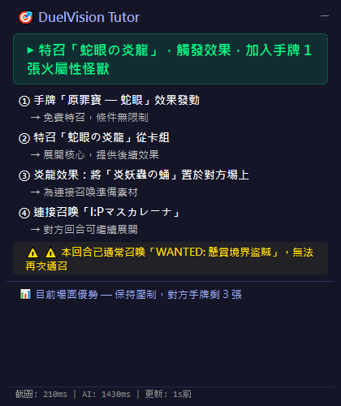
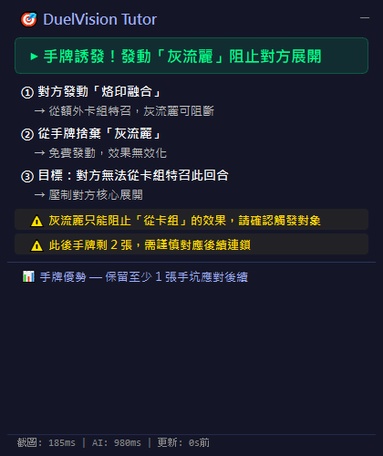
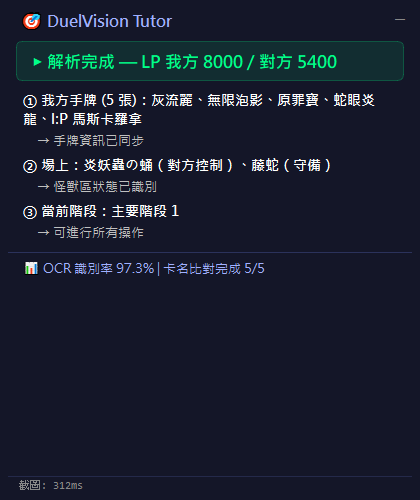
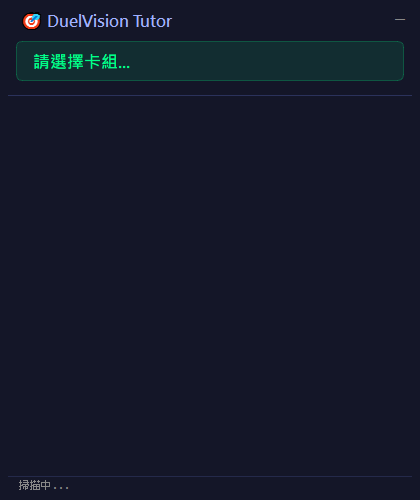

<div align="center">

# DuelVision Tutor

**即時 AI 決鬥教練**

為 Yu-Gi-Oh! Master Duel（PC / Steam）打造的螢幕疊加輔助工具

[](LICENSE)
[](https://www.python.org/)
[](https://www.microsoft.com/windows)
[](https://github.com/IllumiLove)

透過 OCR 即時讀取遊戲畫面，分析當前局勢，結合你的卡組資訊與卡片效果，<br>
由 AI 給出合法且具體的操作建議。

</div>

---

## 目錄

- [截圖展示](#截圖展示)
- [功能特色](#功能特色)
- [技術棧](#技術棧)
- [環境需求](#環境需求)
- [快速開始](#快速開始)
- [設定檔](#設定檔)
- [系統架構](#系統架構)
- [運作流程](#運作流程)
- [授權與版權](#授權與版權)

---

## 截圖展示

<table>
  <tr>
    <td align="center">
      
      <br><b>主疊加視窗</b>
      <br><sub>即時展開路線與步驟說明</sub>
    </td>
    <td align="center">
      
      <br><b>手坑誘發建議</b>
      <br><sub>判斷最佳手坑發動時機</sub>
    </td>
  </tr>
  <tr>
    <td align="center">
      
      <br><b>遊戲狀態解析</b>
      <br><sub>LP、手牌、場上怪獸 OCR 識別結果</sub>
    </td>
    <td align="center">
      
      <br><b>待機狀態</b>
      <br><sub>等待遊戲畫面 / 卡組切換</sub>
    </td>
  </tr>
</table>

---

## 功能特色

| 功能 | 說明 |
|------|------|
| **即時螢幕擷取** | 自動偵測 Master Duel 視窗，以 mss + Win32 API 擷取遊戲畫面 |
| **PaddleOCR 辨識** | 使用 PP-OCRv5（GPU）辨識中文卡名、LP、階段等遊戲資訊 |
| **模糊匹配卡名** | 結合 14,000+ 張卡片資料庫（中 / 英文），OCR 有誤差也能正確識別 |
| **AI 戰術建議** | 透過 DeepSeek API（或本地 Ollama）分析局勢，提供完整展開路線 |
| **操作合法性檢查** | 自動標註觸發條件（特召觸發 / 通召限制 / 手坑），確保 AI 不建議違規操作 |
| **透明疊加視窗** | PyQt6 置頂視窗，即時顯示 AI 建議，不影響正常遊戲 |
| **卡組管理** | 匯入自訂卡組，AI 根據牌組內容規劃 combo 路線 |
| **對戰日誌** | 自動記錄每回合的遊戲狀態與 AI 建議（JSONL 格式） |

---

## 技術棧

| 類別 | 技術 |
|------|------|
| 語言 | Python 3.11 |
| OCR | PaddleOCR 3.x + PaddlePaddle GPU（CUDA 11.8） |
| AI | DeepSeek API / Ollama（可在 `config.yaml` 切換） |
| UI | PyQt6 |
| 卡片資料 | YGOProDeck API + YGOCDB（中文名） |
| 模糊匹配 | rapidfuzz |
| 資料庫 | SQLite |

---

## 環境需求

- Windows 10 / 11（64-bit）
- Python 3.11+
- NVIDIA GPU + CUDA 11.8（PaddleOCR GPU 加速）
- Master Duel 以 **1920×1080** 解析度視窗模式運行

> CPU 模式亦可運行，但辨識速度較慢，修改 `config.yaml` 中 `ocr.use_gpu: false` 即可。

---

## 快速開始

```bash
# 1. 建立虛擬環境
python -m venv .venv
.venv\Scripts\activate

# 2. 安裝依賴
pip install -r requirements.txt

# 3. 設定 API Key
#    複製 .env.example 為 .env，填入 DEEPSEEK_API_KEY=your_key_here

# 4. 匯入你的卡組
python tools/import_deck.py

# 5. 啟動
start.bat
```

或手動執行：

```bat
set PADDLE_PDX_DISABLE_MODEL_SOURCE_CHECK=True
python -m src.main
```

---

## 設定檔

編輯 `config.yaml` 調整運作參數：

```yaml
capture:
  target_window: "masterduel"   # 遊戲視窗名稱關鍵字
  interval: 1.0                  # 掃描間隔（秒）

llm:
  provider: "deepseek"           # deepseek 或 ollama
  deepseek:
    model: "deepseek-chat"
    max_tokens: 2048
    temperature: 0.3

overlay:
  opacity: 0.88                  # 視窗透明度（0.0 ~ 1.0）
  width: 420
  height: 500

deck:
  active: "你的卡組名稱"
```

---

## 系統架構

```
src/
├── capture/        # 螢幕擷取 & 變化偵測
├── parser/         # OCR 引擎 + 遊戲狀態解析（LP、階段、手牌、場上怪獸）
├── database/       # SQLite 卡片資料庫（YGOProDeck + YGOCDB 中文名）
├── advisor/        # LLM 提示詞建構 & API 呼叫
│   └── prompts/    # 系統提示詞模板
├── deck/           # 卡組載入 & 管理
├── overlay/        # PyQt6 疊加 UI
├── logger/         # 對戰紀錄（JSONL）
└── main.py         # 主程式進入點

tools/
├── import_deck.py          # 卡組匯入工具
├── sync_chinese_names.py   # 同步中文卡名至本地 DB
├── debug_capture.py        # OCR 區域除錯截圖
└── take_screenshots.py     # UI 截圖產生腳本

data/
├── cards.db        # SQLite 卡片資料庫（14,000+ 張）
├── decks/          # 卡組 JSON 檔案
└── logs/           # 對戰記錄
```

---

## 運作流程

```
遊戲畫面
   │
   ▼
螢幕擷取（mss）→ 變化偵測（差分比較）
                        │
                        ▼
               PaddleOCR 辨識
               （LP、階段、手牌、場上怪獸）
                        │
                        ▼
               卡名模糊匹配（rapidfuzz + SQLite）
               觸發條件標註（手坑 / 通召限制 / 特召條件）
                        │
                        ▼
               DeepSeek API / Ollama
               → AI 戰術建議 + 合法性驗證
                        │
                        ▼
               PyQt6 疊加視窗即時顯示
```

---

## 授權與版權

Copyright © 2026 [IllumiLove](https://github.com/IllumiLove)

本專案採用 **MIT License（附加商業屬名條款）** 開源。

| 使用情境 | 條件 |
|----------|------|
| 個人學習 / 研究 | ✅ 自由使用 |
| 二次開發 / Fork | ✅ 自由修改，保留版權聲明即可 |
| 非商業分發 | ✅ 允許，保留版權聲明即可 |
| **商業用途（收費、變現）** | ⚠️ **必須明確署名原作者 IllumiLove 並附上本專案連結** |

完整授權條款請見 [LICENSE](LICENSE)。

---

<div align="center">

**DuelVision Tutor** is made with ♥ by [IllumiLove](https://github.com/IllumiLove)

如果這個工具對你有幫助，歡迎給個 ⭐ Star！

</div>
